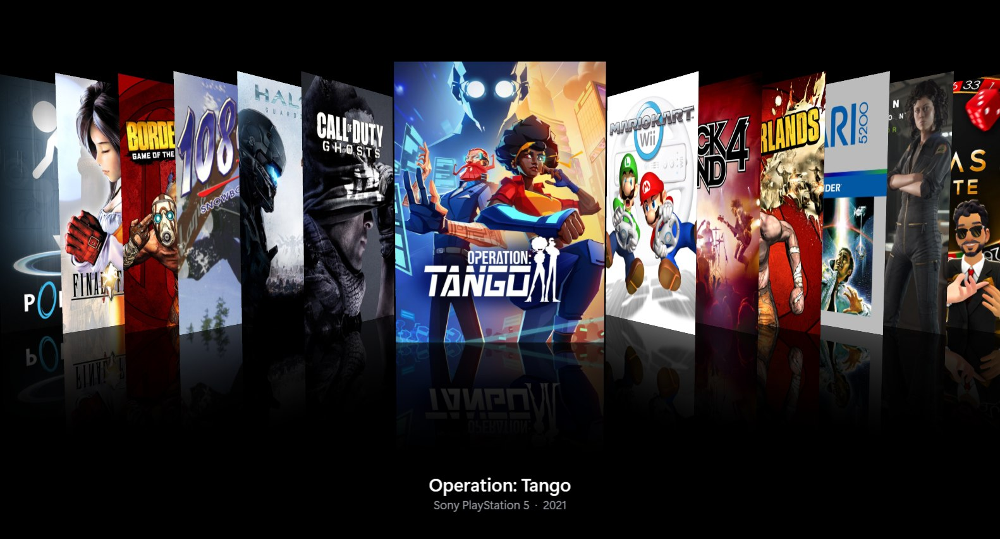

<p align="center"></p>

# PC Game Cover Art Screensaver

A Windows 10/11 screensaver that shows the cover art from your [Playnite](https://playnite.link) or
[Steam](https://store.steampowered.com) library. Choose between two styles, both inspired by old iTunes screensavers:

- **Coverflow:** covers slide past in 3D, with angled side covers and reflections.
- **Mosaic:** a wall of covers that flip over one at a time, like the iTunes Album Artwork screensaver.

**What's new**

- **2.1.0: click a cover to play.** Spot a game you want to play? Move the mouse, click its cover, and the screensaver
  opens it in Playnite or Steam, or starts it straight away. It's optional: turn it on under **Settings… → Display →
  Screens and input → Clicking a cover**.
- **2.0.0: an installer with automatic updates.** One download sets up the screensaver and, for Playnite, the add-on.
  New versions can install themselves once a day, or with one click from the settings window. See [Install](#install).
- **1.3.0: music.** It can play the game soundtracks you've installed through Steam while it runs. See [Music](#music).

**[Download and install](#install)**

**Coverflow**



**Mosaic**, with large tiles


## Features

- Smooth 3D coverflow with reflections, rendered with WPF
- **Mosaic style**, like iTunes' Album Artwork screensaver: a wall of covers that flip over one at a time. You choose how many covers go across; the number of rows follows your screen's shape
- **Large tiles** (mosaic, optional): some games get large tiles, 2×2 up to 6×6, that move around the wall as they flip. You choose how many (1–4) and which games get them:
  - **Games you've barely played** (a backlog spotlight): you set the most hours played that still counts (0 = never played) and a minimum review rating in Steam's terms (Mixed up to Overwhelmingly Positive). For Playnite that's the Community Score, or the Critic Score if there's none. For Playnite you can also leave out games added by hand and games from stores that can't report play time, whose "0 hours" often isn't true. By default that's every store except Steam, Epic, GOG, Xbox, PlayStation and EA app, which are the ones that report play time to Playnite
  - **Any game, at random**: just for variety; every game can come up large or small
- **[Music](#music)** (optional): plays the soundtracks you've installed through Steam while the screensaver runs, with
  shuffle, start at a random track, and volume. It always uses Steam, even when your games come from Playnite
- Works with **Playnite** (all your launchers in one library, through a small add-on) or **Steam** (read directly from
  Steam's own files, with nothing extra to install). No account login or API keys, and no internet connection needed
- **Easy to install and update:** one installer sets up the screensaver and, for Playnite, the add-on. New versions
  install themselves once a day (optional), or with one click from the settings window
- **Click a cover to play** (optional): see a game you fancy? Move the mouse and the pointer appears instead of the
  screensaver closing; click the cover to open that game in Playnite or Steam, or to start it straight away. Turn it on
  under **Settings… → Display → Screens and input → Clicking a cover**
- Standard screensaver behavior: full screen on every monitor, live preview in Windows' Screen Saver Settings, and a settings dialog
- **Optional content filter** hides games with nudity or sexual content, based on their tags, genres, features, categories and age ratings (for Steam: its store tags and content descriptors). You can edit the word list.
- Optional stricter filter for anything rated Mature/18+
- Per-game overrides: `Screensaver: Hide` and `Screensaver: Show`, as tags in Playnite or as collections in Steam
- Order: random, alphabetical, recently played, recently added, release year
- Include or exclude hidden games, installed-only, favorites-only
- Cover shape: use all cover art, or only vertical (box art), only square, or only horizontal covers, so the screensaver looks consistent. In the mosaic, tiles take the chosen shape
- Multi-monitor: mirror, independent, or primary-only. Independent monitors take turns, so only one cover changes at a time across all your screens

## How it works

The screensaver can get your games from either Playnite or Steam. You choose which in its settings.

```
 Playnite ─── PC Game Cover Art Exporter add-on ───► library.json ──┐
                                                                    ├──► PCGameCoverArt.scr
 Steam ─────── Steam's own files (read directly) ───────────────────┘      filters games, draws the covers
```

- **Playnite** keeps its database locked while it runs, so a small Playnite add-on exports a snapshot of your library
  to `%LOCALAPPDATA%\PCGameCoverArt\library.json`, and the screensaver reads that file.
- **Steam** needs no add-on. The screensaver reads the cover art Steam has already downloaded for your library, plus
  Steam's own records of game details, installed games, collections and when you last played. Steam doesn't need to
  be running.
- **Music**, if you turn it on, always comes from the soundtracks installed through Steam, whichever source the covers
  come from.

## Install

You need:

- Windows 10 or 11 (64-bit)
- **Either** [Playnite](https://playnite.link) 10 (the Playnite 11 beta uses a new add-on system that isn't supported
  yet) **or** [Steam](https://store.steampowered.com)

### 1. Run the installer

1. Go to the **[Releases page](../../releases/latest)** and download `PCGameCoverArtSetup_x.y.z.exe` from the
   **Assets** list at the bottom of the latest release.

   Your browser may warn that the file isn't commonly downloaded. In Microsoft Edge, click **…** next to the download
   → **Keep** → **Show more** → **Keep anyway**. In Chrome, click **Keep**. If Windows then says it protected your PC,
   click **More info** → **Run anyway**. These warnings appear because the files aren't code-signed yet.
2. Run it and click **Yes** when Windows asks for administrator permission. The screensaver goes in Windows' own
   screensaver folder, `C:\Windows\System32`.
3. Leave **Use it as my screensaver** and **Install updates automatically** ticked, and click **Install**.
4. On the last page:
   - **Playnite users:** leave **Install or update the Playnite add-on** ticked. Playnite asks whether to install the
     add-on; click **Yes**, then restart Playnite. The add-on saves a list of your games for the screensaver to read,
     right away and again whenever your library changes. This option only appears if Playnite is installed.
   - **Steam users** don't need anything else, but open your library in Steam at least once so it has downloaded your
     games' cover art.
   - Leave **Open the screensaver settings** ticked to go straight to step 2.

The installer adds *PC Game Cover Art Screensaver* to Windows' **Installed apps**, where you can uninstall it later.

### 2. Choose your settings

1. The settings open at the end of the installer. Later, open them from Screen Saver Settings: press **Start**, type
   **screen saver**, choose **Change screen saver**, make sure **PCGameCoverArt** is selected, and click **Settings…**.
2. On the **Library & filters** tab, set **Get games from** to **Playnite** or **Steam**. Then pick the style
   (Coverflow or Mosaic), filters and other options, and click **OK**. With Mosaic, you can also turn on large tiles
   on the **Display** tab, for games you've barely played or for any game at random. To hear your Steam soundtracks
   while it runs, turn them on on the **Music** tab.
3. In Screen Saver Settings, set **Wait** to how many idle minutes to wait before it starts. Tick **On resume, display
   logon screen** if you want your PC to lock when you come back. Click **Preview** to try it (move the mouse or press
   a key to stop), then **OK**.

To check that the Playnite add-on works: in Playnite, open the main menu (☰) → **Extensions** → **PC Game Cover Art
Screensaver** → **Export library for screensaver now**. It tells you how many games it saved.

<details>
<summary>Install without the installer (the .scr and .pext files)</summary>

Each release also has the two files on their own:

| File | What it does | Who needs it |
|---|---|---|
| `PCGameCoverArt.scr` | The screensaver itself. It includes everything it needs, so you don't have to install .NET. | Everyone |
| `PCGameCoverArtExporter_x.y.z.pext` | A Playnite add-on that saves a list of your games and their cover art for the screensaver to read | Playnite users only |

1. **Playnite add-on (Playnite only):** double-click the `.pext`, or drag it onto Playnite's window. Click **Yes**, then
   restart Playnite.
2. **Unblock the screensaver.** Right-click `PCGameCoverArt.scr` → **Properties**. If there's an **Unblock** checkbox
   at the bottom of the **General** tab, tick it and click **OK**. Otherwise Windows may refuse to run a file
   downloaded from the internet as a screensaver.
3. **Copy it into Windows' screensaver folder.** Open File Explorer, go to `C:\Windows\System32`, and drag
   `PCGameCoverArt.scr` into it. Click **Continue** when Windows asks for administrator permission.

   No administrator rights? Move `PCGameCoverArt.scr` to a folder where it can stay, for example
   `Documents\Screensavers` (not Downloads), then right-click it → **Install**. This sets it as your screensaver, but
   it won't stay in Windows' list if you switch to another one later.
4. Continue with [step 2](#2-choose-your-settings) above.

</details>

### Upgrade from an earlier version

You don't need to uninstall anything first, and your settings are kept. Check the notes for your new version below
(they also appear on each release's download page).

- **Automatically:** if you left **Install updates automatically** ticked in the installer, there's nothing to do.
  Once a day, some time in the afternoon (or soon after you next switch the PC on), Windows checks GitHub for a new
  version and installs it quietly in the background. It waits for another day if the screensaver or its settings are
  open. Turn it on or off on the settings window's **About** tab (Windows asks for administrator permission). What it
  did is logged in `C:\Program Files\PC Game Cover Art\update.log`.
- **With one click:** when a new version is out, the screensaver's settings window shows a yellow bar at the top.
  Click **Update now**: it downloads and runs the new installer. It checks when the settings window opens; you can
  turn that off on the **About** tab, where **Check now** also checks by hand.
- **Or** download the new `PCGameCoverArtSetup_x.y.z.exe` from the [Releases page](../../releases/latest) and run it.

The screensaver itself never goes online; only the daily update task and the settings window do.

**Playnite users:** automatic updates install the screensaver only, because Playnite has to install its own add-ons.
When you run an installer yourself (or use **Update now**), leave **Install or update the Playnite add-on** ticked on
its last page, click **Yes** in Playnite, and restart Playnite. The version notes say when an add-on update matters.

The installer closes the screensaver and its settings first, so Windows never complains that the file is in use.

<details>
<summary>Upgrading without the installer, or from a version before 2.0.0</summary>

Versions before 2.0.0 had no installer or update button. To move to the installer, just run it: it replaces the
screensaver in `C:\Windows\System32` and keeps your settings. If you had installed the `.scr` somewhere else (without
administrator rights), you can delete that old copy afterwards.

To upgrade by hand instead:

1. **Update the Playnite add-on first** (Playnite only): double-click the new `.pext`, click **Yes** when Playnite
   asks whether to update it, and restart Playnite.
2. **Close Screen Saver Settings** if it's open. Its little preview runs the screensaver, and Windows won't replace a
   file while it's running.
3. Unblock the new `PCGameCoverArt.scr` and copy it into `C:\Windows\System32`. When Windows asks, choose **Replace
   the file in the destination**.
4. **Check the version** in Screen Saver Settings → **Settings…** → **About**. In Playnite, the add-on's version is
   under main menu (☰) → **Add-ons…** → **Installed** → **Generic**.

</details>

#### Notes for version 2.1.0

When I showed my daughter the screensaver, she watched the covers go by for a moment and said, "That's cool. If you
click on a game, does it play it?" I had to tell her no. Today I get to tell her yes.

- **Click a cover to play:** a new **Clicking a cover** option under **Settings… → Display → Screens and input**. Set
  it to **Show the game in Playnite or Steam** or **Play the game**, and moving the mouse shows the pointer instead of
  closing the screensaver. Click a cover to open or start that game; click anywhere else or press a key to close as
  usual. It's off by default, so nothing changes unless you turn it on.
- Nothing changed in the Playnite add-on apart from its version number, so updating it is optional.

#### Notes for version 2.0.2

- **Choose where the music plays:** a new **Play through** option on the Music tab sends the soundtracks to the
  speakers or headphones you pick, instead of always using Windows' default output. If that device isn't plugged in
  when the screensaver starts, the music plays through the default output. See [Music](#music).
- Nothing changed in the Playnite add-on apart from its version number, so updating it is optional.

#### Notes for version 2.0.1

- Fixes **automatic updates**, which didn't run in 2.0.0: Windows' Task Scheduler couldn't start the screensaver's
  program, so the daily check never happened.
- **If you have 2.0.0, update this once by hand:** open the screensaver settings and click **Update now** on the
  yellow bar, or run the 2.0.1 installer. After that, updates install themselves again.
- Nothing changed in the Playnite add-on apart from its version number, so updating it is optional.

#### Notes for version 2.0.0

- New in 2.0.0: an **installer**, `PCGameCoverArtSetup_2.0.0.exe`. One download sets everything up: it puts the
  screensaver where Windows looks for it, can make it your screensaver, and offers to install the Playnite add-on.
  It also adds an uninstaller to Windows' Installed apps.
- **Automatic updates:** the installer can set up a daily check that installs new versions by itself, quietly in the
  background. It's ticked by default; change it on the About tab.
- The settings window also **tells you when there's a new version** and can install it with one click. It asks GitHub
  when the window opens; turn that off on the About tab. The screensaver itself still never goes online.
- To move to the installer, just run it over your current version; your settings are kept. See
  [Upgrade from an earlier version](#upgrade-from-an-earlier-version).
- Nothing changed in the Playnite add-on apart from its version number. Updating it is optional, unless you're coming
  from a version before 1.3.2 (see the 1.3.2 notes).

#### Notes for version 1.3.2

- New in 1.3.2: large tiles for **games you've barely played** can leave out games whose play time Playnite can't
  know: games added to Playnite by hand, and games from stores that don't report play time. By default that's every
  store except Steam, Epic, GOG, Xbox, PlayStation and EA app. Change it under **Settings… → Display → Mosaic →
  Leave out**.
- **This is on by default**, so if you already use large tiles for barely played games, fewer games may qualify
  after upgrading. The line under the options says how many do.
- **Playnite users must update the add-on** (install the new `.pext` and restart Playnite) so it exports again, for
  these options to work. Older add-ons don't save which store each game came from, so until then no game is left out.
- Steam users don't need to do anything: every game's play time comes from Steam.

#### Notes for version 1.3.1

- New in 1.3.1: the mosaic's large tiles can go to **any game, at random**, instead of only games you've barely
  played. Choose it under **Settings… → Display → Mosaic → Which games**. If you already use large tiles, they keep
  working as before until you change it.
- Nothing changed in the Playnite add-on apart from its version number, so updating it is optional.

#### Notes for version 1.3.0

- New in 1.3.0: the screensaver can play the soundtracks you've installed through Steam, with shuffle, start at a
  random track, and volume. Turn it on under **Settings… → Music**. It's off until you do. See [Music](#music) for
  how to set it up.
- The music always comes from Steam, even if your games come from Playnite, so Playnite users need Steam installed
  (with some soundtracks) to use it.
- Nothing changed in the Playnite add-on apart from its version number. Updating it is optional, unless you're coming
  from a version before 1.2.0 (see the 1.2.0 notes).

#### Notes for version 1.2.0

- New in 1.2.0: Mosaic can show games you've barely played as large tiles. Turn it on under
  **Settings… → Display → Mosaic**.
- **Playnite users must update the add-on** (install the new `.pext` and restart Playnite) to use large tiles. Older add-ons don't save play time or review
  scores, so until the new add-on has saved your library, no Playnite game counts as barely played.
- Steam users don't need to do anything extra: play time and review ratings are read from Steam's own files.

### Uninstall

1. Open **Settings** → **Apps** → **Installed apps**, find **PC Game Cover Art Screensaver**, and click **…** →
   **Uninstall**. If it was your screensaver, Windows goes back to none. The daily update task is removed too. (Installed by hand, without the installer? In
   Screen Saver Settings choose a different screensaver, then delete `C:\Windows\System32\PCGameCoverArt.scr`.)
2. If you use Playnite: open the main menu (☰) → **Add-ons…** → **Installed** → **Generic**. Select **PC Game Cover Art
   Exporter**, click **Uninstall**, and restart Playnite.
3. Optional: delete the folder `%LOCALAPPDATA%\PCGameCoverArt`, which holds your settings and the saved library.
   Paste that path into File Explorer's address bar to find it.

### Troubleshooting

| Problem | What to do |
|---|---|
| The screensaver says **"No Playnite library export found"** | The add-on hasn't saved your library yet. Make sure it's installed (the installer's last page offers it), restart Playnite, or use **Export library for screensaver now**. |
| It says **all games were filtered out**, or shows fewer games than you expect | Open **Settings… → Library & filters**. The box at the bottom shows how many games each filter hides. |
| A game you don't want to see still appears | In Playnite, add the tag `Screensaver: Hide` to it. In Steam, add it to a collection named `Screensaver: Hide`. |
| **Steam wasn't found** | In **Settings… → Library & filters**, click **Browse…** next to the Steam folder and choose the folder Steam is installed in. |
| A Steam game is missing, or shows a title card instead of its cover | Steam hasn't downloaded its artwork yet. Open your library in Steam and scroll past the game, then start the screensaver again. |
| The wrong Steam account's games appear | The screensaver uses the account that signed in to Steam most recently. Sign in to Steam with the account you want once. |
| A game you've played a lot keeps getting a large tile | Playnite only knows the play time for games from stores that report it, or games you start from Playnite. Under **Settings… → Display → Mosaic → Leave out**, tick the game's library, or **Games added to Playnite by hand**. |
| Mosaic shows no large tiles | Under **Settings… → Display → Mosaic**, the line below the large tile options says how many games qualify. If it's 0, choose **Any game, at random**, untick some **Leave out** options, or raise **Played for at most** or lower **Review rating**. Playnite users: update the add-on (see [Upgrade](#upgrade-from-an-earlier-version)) and use **Export library for screensaver now**. Playnite games also need a Community or Critic Score, which comes from downloading metadata. |
| Clicking a cover just closes the screensaver | Turn on **Settings… → Display → Screens and input → Clicking a cover**. Move the mouse first so the pointer shows: a click while it's hidden only closes the screensaver. |
| Clicking a cover closes the screensaver but nothing opens | Playnite games open through Playnite and Steam games through Steam, so that launcher has to be installed. If you ticked **On resume, display logon screen**, sign in first: the game or launcher opens behind the sign-in screen. |
| No music plays | Open **Settings… → Music**. The line under the options says how many soundtracks were found. Soundtracks have to be installed in Steam: in your Steam library, pick **Soundtracks** in the filter, then install the ones you want. Music doesn't play in the small preview in Screen Saver Settings, only in full screen. |
| Windows says the file is in use when you replace `PCGameCoverArt.scr` by hand | Close Screen Saver Settings (its preview is running the old version) and try again. The installer avoids this by closing it for you. |
| Automatic updates don't seem to happen | Look in `C:\Program Files\PC Game Cover Art\update.log`: each daily run says what it did. It skips a day while the screensaver or its settings are open, and needs an internet connection. On the **About** tab, check **Install updates automatically** is ticked. |
| The settings window can't check for updates | It needs to reach GitHub. Check your connection, or turn off **Check for updates** on the **About** tab and get new versions from the [Releases page](../../releases/latest). |
| **PCGameCoverArt** isn't in Windows' list | Run the installer again. If you installed by hand, check that `PCGameCoverArt.scr` is in `C:\Windows\System32`, then reopen Screen Saver Settings. |
| It doesn't start, or closes immediately | Run the installer again. If you installed by hand, unblock the file (right-click → **Properties** → **Unblock**) and copy it again. |
| Something else | Look in `%LOCALAPPDATA%\PCGameCoverArt\screensaver.log` and include it when you [open an issue](../../issues). |

## Music

The screensaver can play the game soundtracks you've installed through Steam while it runs. It's off until you turn
it on.

### Set it up

1. **Install some soundtracks in Steam.** Soundtracks you own (bought on their own, or included with a game's special
   edition) are listed in your Steam library. Choose **Soundtracks** in the filter at the top of the library list, then
   install the ones you want, just like a game. Steam puts them in `steamapps\music` in your Steam library folder.
2. **Turn on the music.** Open Screen Saver Settings → **Settings…** → **Music** tab, tick **Play my installed Steam
   soundtracks while the screensaver runs**, and click **OK**. The line under the options says how many tracks and
   soundtracks it found.
3. **Try it.** Click **Test full screen** in the settings, or **Preview** in Screen Saver Settings. Move the mouse or
   press a key to stop.

### Options

| Option | What it does |
|---|---|
| **Shuffle** (on by default) | Plays every track once in a random order, then reshuffles. The same track never plays twice in a row. |
| **Start at a random track** | With shuffle off, the music plays album by album in track order. This starts it somewhere random instead of at the first track, then carries on in order. It's greyed out while Shuffle is on, because shuffle already starts on a random track. |
| **Volume** | 0–100%. The music fades in over the first few seconds. |
| **Play through** | The speakers or headphones the music plays through. **Windows default output** (the default) follows whatever Windows is set to, even if you change it while the music plays. If the device you choose isn't plugged in when the screensaver starts, the music plays through the default output instead. |

### Good to know

- **It always uses Steam**, even when your games come from Playnite, because Playnite doesn't keep track of
  soundtracks. Steam doesn't need to be running. If Steam is installed somewhere unusual, choose its folder under
  **Library & filters**; the music uses that setting too.
- **All your Steam library folders** are included, on every drive.
- **One copy of each track.** Many soundtracks come in several formats at once (MP3, FLAC and WAV). The screensaver
  plays one format per album, MP3 when there is one, so you don't hear every track two or three times.
- It plays MP3, FLAC, M4A, WMA and WAV files. Files Windows can't play are skipped.
- The music plays once however many monitors you have, and stops as soon as the screensaver closes.
- The small preview picture in Screen Saver Settings stays silent.

## About the content filter

Playnite doesn't flag nudity by itself, so the filter can only use the metadata your games have. With the
default word list, a game is hidden if any of its tags, genres, features, categories or age ratings contains
one of these words (whole-word, not case-sensitive):

`Nudity`, `Sexual`, `Erotic`, `Hentai`, `NSFW`, `Eroge`, `Adults Only`, `ESRB AO`, `Adult Content`, `Porn`

For **Steam** games, the filter checks their store tags (such as *Nudity* and *Sexual Content*) and the content
descriptors publishers fill in for Steam (such as *Some Nudity or Sexual Content* and *Adult Only Sexual Content*).
These contain the same words, so the default list catches them too.

The settings dialog shows how many games each rule hides. If the filter misses a game, add the `Screensaver: Hide` tag
to it in Playnite, or add it to a Steam collection with that name. If it hides a game by mistake, use
`Screensaver: Show` the same way.

## Building from source

Requirements: Windows, [.NET 10 SDK](https://dotnet.microsoft.com/download).

```powershell
dotnet test tests/CoverArtSaver.Tests          # unit tests (run on any OS)
dotnet run --project src/CoverArtSaver -- /w   # try it in a normal window
./scripts/build-release.ps1                     # produces dist/*.scr and dist/*.pext
```

[docs/GUIDE.md](docs/GUIDE.md) is a full walkthrough of the project: the architecture, a tour of the code, testing, and releasing.

| Project | What it is |
|---|---|
| `src/CoverArtExporter` | Playnite add-on (.NET Framework 4.6.2, Playnite SDK) that writes `library.json` |
| `src/CoverArtSaver.Core` | UI-free logic: settings, filtering, ordering, command-line parsing, coverflow math |
| `src/CoverArtSaver` | WPF app that becomes the `.scr`: rendering, windows, settings dialog |
| `tests/CoverArtSaver.Tests` | xUnit tests for the Core project |

## Privacy

The screensaver itself never goes online. Only two parts do, and only to GitHub, where this project is hosted:

- **The settings window** asks GitHub for the latest release when it opens, to show the "new version" bar. Turn this
  off on the **About** tab (**Check for updates when this window opens**).
- **Automatic updates**, if turned on in the installer or on the **About** tab, ask GitHub once a day for the latest
  release, and download its installer when there's a new version.

These requests contain no information about you, your PC or your games. Like any website, GitHub sees your IP address
and the app's version number; see [GitHub's privacy statement](https://docs.github.com/site-policy/privacy-policies/github-general-privacy-statement).
Nothing else is collected or sent anywhere: your settings, game library and logs stay on your PC.

## Code signing

Releases aren't code-signed yet, so the first time you download and run the installer, your browser and Windows
SmartScreen may warn about it (see [step 1 of Install](#1-run-the-installer)). Updates installed by the screensaver
itself don't show these warnings.

Every file on the [Releases page](../../releases) is built from this repository's source by its GitHub Actions
workflow, not on anyone's PC. To check a download is the real thing, compare its SHA-256 with the one GitHub shows next
to the file on the release page: in PowerShell, run `Get-FileHash PCGameCoverArtSetup_x.y.z.exe`.

## Contributing

Issues and pull requests are welcome. Run `dotnet test` before submitting. By contributing, you agree that your
contributions are licensed under the project's [MIT License](LICENSE).

## License

PC Game Cover Art Screensaver is released under the [MIT License](LICENSE). Copyright (c) 2026 ShawnPlays.

You're free to use, copy, change and share it, including in other projects, as long as you keep the copyright
notice and license text. It comes with no warranty.

- The screensaver includes the .NET runtime, which is also MIT-licensed. See [THIRD-PARTY-NOTICES.md](THIRD-PARTY-NOTICES.md).
- The license and notices are included in both downloads: in the screensaver's **Settings… → About** tab, and as
  `LICENSE.txt` inside the add-on package.
- Game cover art belongs to its respective owners. This project doesn't include or distribute any.
